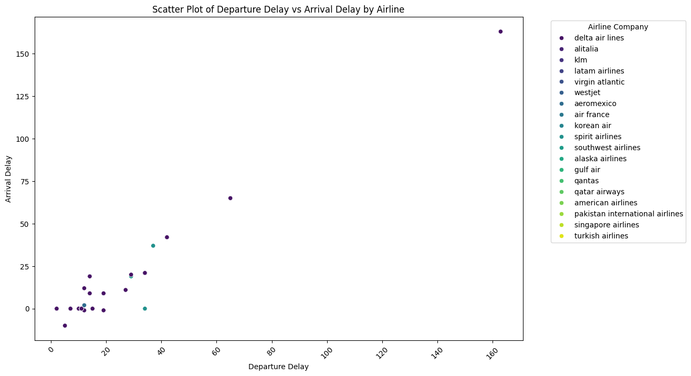

# 📝 DS105A Final Group Project: Turkey, Duck, and Fish 📝 

--- 

## ✍️ Team Members ✍️
- `Chaoyang Feng (oche32) | BSc in Politics and Data Science` 
- `Kylin Gao (gaoonline) | BSc in Economics`  
- `Anka Uysal (ankauysal)| BSc in Economics`  
- `Sissi Wang (Huanxi-Wang) | BA in History` 

--- 

## ✈️ Overview of Analysis ✈️

Flights are an essential part of many people's lives. No matter what you do for a living or where you are from in the world, it is likely that you need to travel by plane at some point. Perhaps you are an international student (like us) going back and forth to univerity, an employee travelling for work, an expat visiting your family in your home country, or simply a travel enthusiast observing the world with friends... If you fall into one of these categories, it is likely that you are interested in booking the flight that is the most efficient for you. As people who fly quite frequently, we were motivated to analyze which flights are the best in terms of minimum delays. Join us here on our page to read more about our analysis regarding flight delays. We have analyzed xxx to help everyone find the most optimal flight time/route/xxx in order to have the best possible experience with flights. 

---

## ⚙️ The Data ⚙️

### ⏳ Procedure Map ⏳

Here is a procedure map that provides an overview of our data sourcing and collection procedure: 
xxxx - insert data collection procedure map here 

### 📊 Data Source 📊

In our analysis, we have used flight delay data from the Aviyair API, which is available through subscription. This API has provided us with historical data, allowing us to analyze dense flight delay data from August 31 - September 9, 2023. The data contains more than xxx flights from a wide range of airports, including xxx, and airlines, including xxx.

It must be recognized here that while there is much information readily available on the internet regarding current delays on flights, it is very hard to find organized historical flight data, which we need to conduct out analysis. In our data sourcing process, we have tried and failed to find a proper data source many times before suceeding with the Aviyair API. We have tried collecting data through many APIs, the most extensive ones being the Aviationstack API and the Airlabs API. While some APIs have allowed us to collect insufficient (either due to information or volume), some we have not been able to access since many are only available through a paid subscription. xxxxx.....  Our data has allowed us to bring this together and present our findings coherently. 

### 🖇 Data Collection 🖇

We have collected data from xx airports in the xxx timeframe. This will allow us to make an accurate prediction regarding xxx. 

### 🔬 Final Data 🔬

Here is our final data frame: put csv link 

--- 

## 📈 The Exploratory Data Analysis 📈

Based on the data we collected, here are the visualizations and our conclusing analysis: 

### analysis 1 

explanation

### analysis 2 

.png "Exhibit2(2)")
--- 

## 📝 Conclusion 📝

There are many reasons that flights can be delayed and these reasons can interact even further to impact flight delay times. Our conclusions show that xxx. While it is a limitation that the uncertain nature of flight delays could mean that outliers are likely, our analysis proves that xxx. This information can help you book your next flight to be the most time efficient it can be! 

--- 

## References 

- ChatGPT 
- Aviyair API 
- xxx 

