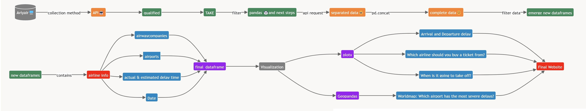

# 📝 DS105A Final Group Project: Turkey, Duck, and Fish 📝 

--- 

## ✍️ Team Members ✍️
- `Chaoyang Feng (oche32) | BSc in Politics and Data Science` 
- `Kylin Gao (gaoonline) | BSc in Economics`  
- `Anka Uysal (ankauysal)| BSc in Economics`  
- `Sissi Wang (Huanxi-Wang) | BA in History` 

--- 

## ✈️ Overview of Analysis ✈️

Flights are an essential part of many people's lives. No matter what you do for a living or where you are from in the world, it is likely that you need to travel by plane at some point. Perhaps you are an international student (like us) going back and forth to univerity, an employee travelling for work, an expat visiting your family in your home country, or simply a travel enthusiast observing the world with friends... If you fall into one of these categories, it is likely that you are interested in booking the flight that is the most efficient for you. As people who fly quite frequently, we were motivated to analyze which flights are the best in terms of minimum delays. Join us here on our page to read more about our analysis regarding flight delays. We have analyzed flight delay data from over 700,000 flights to help everyone find the most optimal flight!

---

## ⚙️ The Data ⚙️

### ⏳ Procedure Map ⏳

Here is a procedure map that provides an overview of our data sourding and data collection procedure: 

### 📊 Data Source and Data Collection Challenges 📊

In our analysis, we have used flight delay data from the Aviyair API, which is available through subscription. This API has provided us with historical data, allowing us to analyze dense flight delay data from August 31 - September 9, 2023. The data contains more than 700,000 flights (732,880 to be exact) from a wide range of airports, including LAX, ATL, and JFK, and airlines, including Delta, Air France, and KLM. This extensive data set will allow us to make an accurate prediction regarding where, when, and with which airlines delays occur the most. 

It must be recognized here that while there is much information readily available on the internet regarding current delays on flights, it is very hard to find organized historical flight data, which we need to conduct out analysis. In our data sourcing process, we have tried and failed to find a proper data source many times before suceeding with the Aviyair API. We have tried collecting data through many APIs, the most extensive ones being the Aviationstack API and the Airlabs API. While some APIs have allowed us to collect insufficient (either due to information or volume), some we have not been able to access since many are only available through a paid subscription. We have essentially decided to collect data through the Aviyair API through paying a basic subscription. Our data has allowed us to bring this analysis together and present our findings coherently. 

### 🔬 Final Data 🔬

[Here](final_data.csv) is our final data frame. The final data frame has information about 732,880 flights. Our columns include (but are not limited to) departure airport IATA, arrival airport IATA, delay in mins, estimated delay, and airline company. The most used columns in our visualizations are the estimated vs. actual delays and the airport codes. Most of our columns are objects as in data types, but we convert all our columns to the best data type for our analysis in further steps. 

--- 

## 📈 The Exploratory Data Analysis 📈

Based on the data we collected, here are the visualizations and our concluding analysis: 

### Analysis 1.1
{ width=800px height=600px }

**Explanation:** This plot is our most comprehensive and general visualization. This plot uses all of our available data and shows both arrival and departure delay data. This plot shows that departure delay and arrival delay are not always the same! There is frequently a difference between departure delay and arrival delay, which we will investigate in further visualizations. Using this basis, we start applying limits to the data set to check which variable affects the arrival delay most. 

### Analysis 1.2
{ width=800px height=600px }

**Explanation:** This plot is a more targeted version of the previous plot (Analysis 1.1).Here, we highlight a specific airport’s correlation between departure and arrival delays. In our analysis, we observe that larger airports, such as LAX, tend to have a correlation that is less linear than the average correlation. A possible explanation for this phenomenon might be that since larger international airports such as LAX have a lot more international flights (which mean flights with longer durations), planes can have more time to catch up on the delay to minimize arrival delay midair - causing the larger difference between departure and arrival delays. 

### Analysis 1.3
{ width=800px height=600px }

**Explanation:** In Analysis 1.3, we also wanted to check the possibility that the airlines are the cause of the distribution of arrival vs. departure delays. Therefore, in this visualization, we have plotted out the arrival vs. departure delay specifically for Delta Airlines. We chose Delta Airlines due to its wide range of flights and its overall representativeness of an average airline with both international and domestic fligts. The correlation here looks pretty similar to the one in Analysis 1.1 where all data points are plotted. Therefore, we think that there is no reason to believe that airlines themselves significantly affect delays. 

### Analysis 1.4
{ width=800px height=600px }

**Explanation:** In Analysis 1.4, the most specific version of the scatterplots so far, we have looked at the correlation between arrival and departure delay between ATL (in Atlanta, Georgia, USA) and RSW (Fort Myers, Florida, USA) – for more insight. A flight from ATL to RSW is usually under 2 hours and the graph shows that delays are usually caught up midair. This shows us that some relatively short distance flights can also catch up with their delays - this is not exclusive to longer and international flights. 

### Analysis 2 

")

**Explanation:** To settle the question of whether long or short distance flights are more likely to experience delays (which was investigated in previous plots), we have mapped out all the delays from flights flying out of LAX. We chose LAX because it dispatches flights both across the US and worldwide. We observe here that most of the flights that caught up time midair are flights to other states in the US. Surprisingly, some of the most delayed flights are the ones to countries near the US, such as Canada and Mexico. Most flights across the Atlantic Ocean displayed that they caught up midair. However, we also observe that airports in the same country tend to have similar delay time. Therefore, we have reason to believe that the country of destination and the airlines that commonly fly between two given countries might contribute to the flight delay. 

### Analysis 3

{ width=800px height=600px }

**Explanation:** Recognizing previous correlations, we concluded that it might be more useful to look into airlines that frequently fly between two countries instead of the countries themselves. This is because people do not realistically choose their destination country based on flight delays. What people can do, however, is to change which airline they fly to their destination country. In this plot, it is observed that there are slight differences between arrival delay averages of different airlines. However, overall, there is no significant difference and no meaningful conclusion can be drawn. 

### Analysis 4
{ width=800px height=600px }

**Explanation:** At this point, in Analysis 4, we are concluding our investigation of flight delays. Considering all the data we have collected, we want to provide the user with a tool that will directly contribute to and hopefully improve their experience with flight delays. By providing information about the flight route, the website will output an average time that the passenger will wait at their departure airport. 
--- 

## 📝 Conclusion 📝

There are many reasons that flights can be delayed and these reasons can interact even further to impact flight delay times. Our conclusions show that departure delay largely depends on the airport. Larger airports like LAX tend to have more arrival delays than departure delays. 

Arrival delay largely depends on the distance of the flight – if the flight is extremely long or short, it is likely that the flight will be able to catch up sometime midair. If the flight is domestic, it is more likely that the departure delay will be caught up in the air. Arrival delay also depends on the country that one is flying to. On the other hand, there is little to no difference between the airlines for international flights. Therefore, choosing a specific airline will not necessarily impact a passenger's delay time.

It is a limitation of our analysis that the uncertain nature of flight delays could mean that outliers are likely. However, we hope that interacting with this website can help you book your next flight to be the most time efficient it can be! 

--- 

## References 

- ChatGPT (More information can be found in the ChatGPT usage report.)
- Aviyair API (Available through subscription.)

